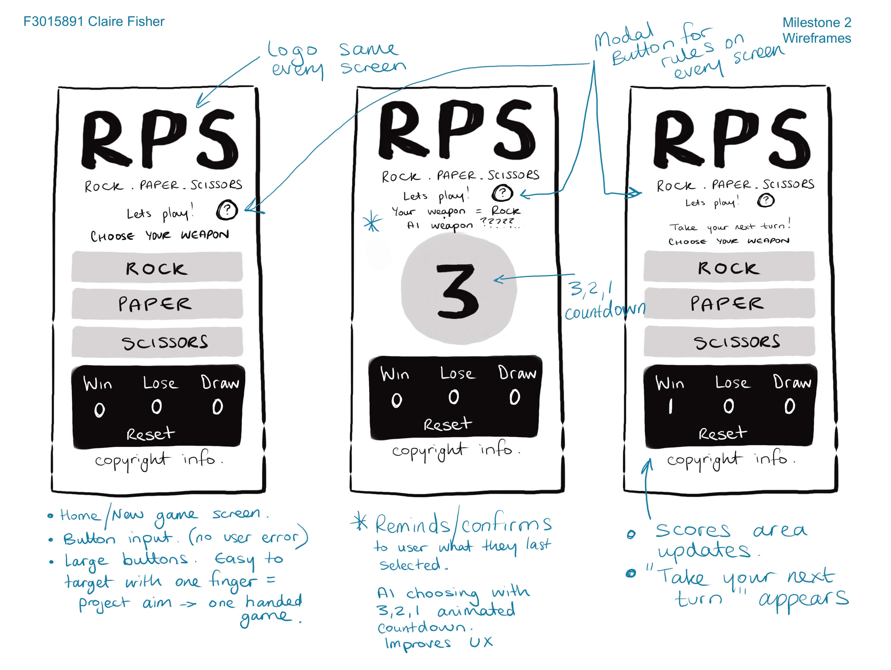
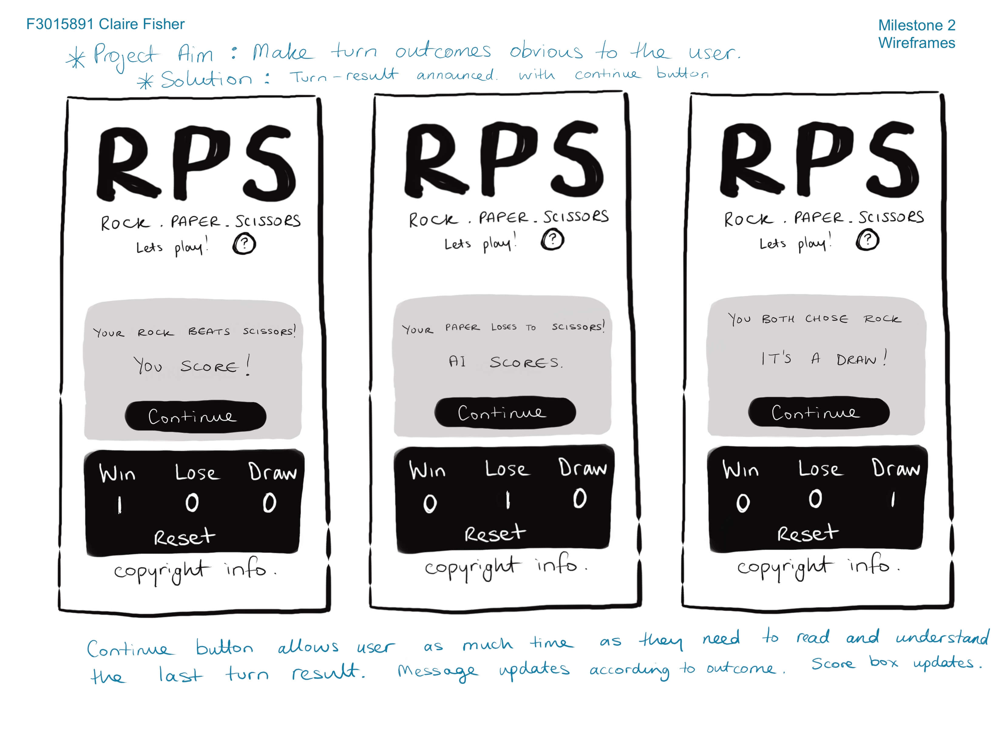
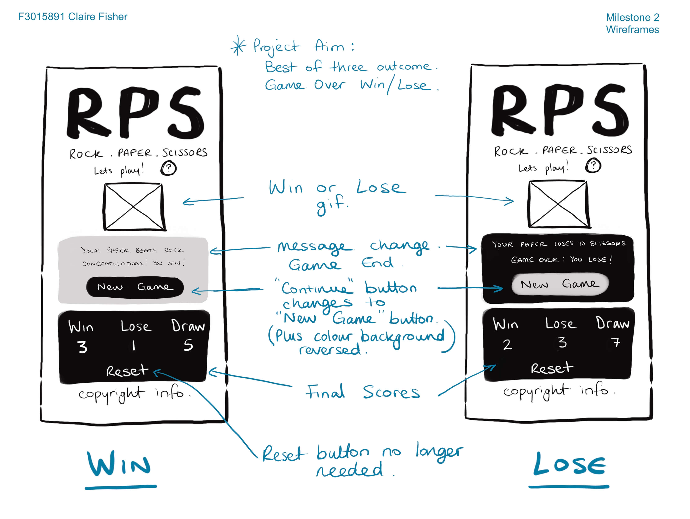
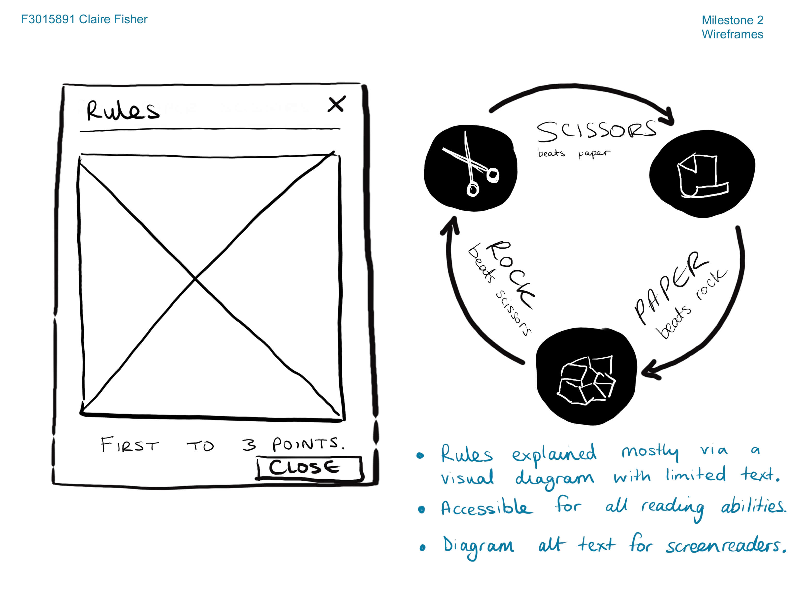

# Rock Paper Scissors
### This site is designed as a pick-up-&-play game for entertainment. 
This project is intended for users of any age. Target users are most likely access this on mobile devices. Therefore it is developed using a mobile first approach and is fully responsive. The project aims to meet high standards of accessibility requirements. 

[Click here to deploy this project live](https://claire-fisher.github.io/rock-paper-scissors-ms2/)

## Table of Contents
[Planning and Development](#planning-and-development)

[Features](#features)

[Future Features](#future-features)

[Testing](#testing)

[Deployment](#deployment)

[Languages](#languages)

[Frameworks and Tools](#frameworks-and-tools)

[Software](#software)

[Code](#code)

[Credits](#credits)

# Planning and Development
### Target Audiences
- Users of all age groups.
- Users who are looking to spend some time on a simple game.
- Users who want a game for a couple of seconds, to a couple of minutes, and beyond.
- Users who want a clear and easy-to-use game with simple, familiar rules.
- Users who want entertaining while waiting for something (commuters, patients in a waiting room etc).

### User Stories
1. As a user, I want to be entertained.
2. As a user, I want to have a positive user experience.
3. As a user, I want the game to be intuitive and the rules easy to find.
4. As a user, I want to use the project across multiple devices.
5. As a travelling user, I want to be able to play the game with my mobile device in one hand, while I hold onto a transport safety rail, or bags of groceries.
6. As a differently abled user, I want the buttons and text to be of good contrast and larger size for accessiblity.  
7. As a colour blind user, I want the project to work clearly in grayscale.

### Site Objectives
1. To provide a positive user experience.
2. To create an intuitive UI that provides good site flow.
3. To build a family-friendly game that is appropriate for all ages.
4. To build a single-finger playable game. 
5. To deliver a game that is responsive on a large variety of screen sizes and mobile devices.
6. To create a fast, easy-to-use game that can be enjoyed in less than 1 minute.
7. To deliver a game that implements accessibility needs to a high level.

### Approach
- Mobile first design.
- The game functionality will be provided to the user logically and intuitively.
- The site will be created following the principles of user experience design.
- The content of the site will be inoffensive and accessible to all.
- Clean, professional design, with consistent colour-scheme, style and layouts throughout.

### Research
The following sites were examined as part of my project research:
- https://www.online-stopwatch.com/chance-games/rock-paper-scissors/
- https://www.coolmathgames.com/0-rock-paper-scissors
- https://www.twoplayergames.org/game/rock-paper-scissors

Common themes found:
  - Responsive design.
  - Neutral backgrounds to page styling.
  - Colourful, busy designs, auto-played music.

My adjustments to suit my project aims:
  - Less colour. Keep to a greyscale palette for better accessibility. 
  - Clearer feedback to the user on their choice and the AI choice. 
  - No auto play music that can reduce a users positive UX.
  - A best of three outcome. A game that has a definite win or lose outcome is more satisfying to the user. 

### Wireframes

Procreate was used to document research, sketch out initial ideas, page layouts and wireframes.

Please toggle the following dropdowns to view the wireframe images.

Wireframe Mobile: Home/Countdown/Next-Turn image

Wireframe Mobile: Turn-result image

Wireframe Mobile: Game Over Win/Lose image

Wireframe Mobile: Game-Rules-Modal image

 

This planning and development work is uploaded to Figma. The design page on Figma is a useful tool to layout all my early project documents in one space, and share online with others for additional input. It allowed my mentor to quickly view and understand my project themes and objectives.

Using Figma's wireframes capabilities, I was able to play with initial layouts and plan intuitive flow around my site. This has given me a good understanding of how an MVP might be presented to me by a frontend designer.

Please click the link to view my development work on Figma:[View here](https://www.figma.com/file/5D9C0Ra8mOWScMFT2Mqq1e/RPS-Designs-%26-Development?type=design&node-id=0-1&mode=design&t=GZVaXRDeF3EGs5T8-0)

### Colour Scheme

A reduced colour scheme of three greys (#f9f9f9, #c9c9c9, #222222) has been chosen for this project. The advantages of this are as follows:
  - Clean, professional design with universal appeal.
  - Reduced screen glare for all users as lightest shade is off-white, and darkest is off-black. 
  - Better accommodates users with higher visual requirements (Site objective No.7).
  - Project also displays extremely well on mobile devices set to dark mode.  

### Typography
'Inter" from Google Fonts was selected throughout as a clear, easily-readable font choice. [View here](https://fonts.google.com/specimen/Inter?query=inter)

A generic 'serif' font has been included as a backup in the event 'Inter' fails to load or is incompatible with the user's browser. 

# Features

This project consists of one page with 14 features.

### Fully Responsive 
- This site adapts to all devices and screen sizes ranging between 320px to 2560px wide (Tested).

### Intuitive Navigation
- The rules button is present on every page and stays in the same location.
- The weapon buttons are large, obvious and stay in the same location. Shifting only from horizontal to vertical alignment dependant on screen width. 
- All buttons are named with intuitive text so navigation is clear to the user (e.g Continue, New Game) (Site objective No.7).
- All buttons have aria-labels to allow good navigation for users with screen-readers. (Site objective No.7).

### Clear typography
- The highly legible and readable font 'Inter' was selected from googlefonts. As a googlefonts listed typography, 'Inter' has a high chance of being useable across most devices. A generic 'serif' font has been coded to display in the event a device is not compatible with 'Inter'. 

### Logo
- Custom designed Logo in keeping with project brand asthetics: both in colour and typography.
- SVG format for optimum resolution quality at all screen sizes.

### Images
- Game over gifs have been included to increase the users positive experience. (Site objective No.1).
- All images and gifs included aria-labels and/or alt attributes for accessibility (Site objective No.7).
- To prioritise performance (Site objective No.6), all images and gifs are:
  - Limited.
  - Compressed for faster load times.
  - Included as files in the assets folder to increase download times.

### Fully automated game functionality
- The user is only required navigate and input their weapon selection with a choice of three buttons. 
- The AI's choice, turn result, score keeping and final result are all fully automated and displayed to the user. 

### 3-2-1 Countdown
- An animated short countdown gives the illusion that the AI is "thinking" about it's weapon selection. It builds suspense before the turn result, improving UX. 
- The countdown allows the user a moment to read and be reminded of their latest weapon choice, while not interrupting site flow.
- This feature also improves accessibilities by allowing users with cognitive, and/or reading difficulties, a moment to process the game information (Site objective No.7).

### Game Win Result
- The game randomly selects one of five different gifs when the player achieves a win result. In contrast to the singular "Game Over: You Lose" ending, this is more rewarding for the player when they win (Site objective No.1). 

### Large Buttons
- Buttons have been built for all user interactions with this project. This eliminates user input error so the game functions are rapid, and excellent site flow is maintained. (Site objectives No.1, 2, 6).
- They are designed with a minimum size of 48px x 48px. These are the WCAG 2.1 recommended guidelines for touchscreen buttons (Site objective No.7).
- It improves usability for all users, especially when using their device single handed. Input doesnt need to be typed and is selected with a simple button press (User story No.5).
- It improves accessibility for people with physical disabilities who have dexterity needs (Site objective No.7). 

### Colour scheme
- The minimum colour palette has universal appeal.
- Eye comfort. The lightest shade (#f9f9f9) is off-white, and the darkest shade (#222) is off-black. This reduces screen glare for all users. 

### Dark Mode
- Due to the high contrast colour scheme, this project works well on dark mode screen settings. 

### High Standards of Accessibiliy 
[According to accessguide.io](https://www.accessguide.io/)

(Site objective No.7).
- Definite status messages - 404 page included - "Oops, something went wrong" message.
- Responsive design.
- High colour contrast.
- No colours convey information - colourblind users
- No flashing lights. Care has been taken to select gifs with minimum to no flashing lights.
- No background audio or autoplay audio.
- Aria-labels on all interactive elements.
- Alt descriptions on all images.
- Semantic elements to assist screen reader users to navigate and access information.
- Consistent navigation.
- Written content is at an approachable level.
- Minimum font size of 16px throughout the site and on all screen sizes.  
- Custom visual graphic of the game rules. This minimises the amount of written information needed to be understood by the user. It helps those with cognitive difficulties. An brief but descriptive aria-label has been given to the rules image for visually impaired users. 
- Pausable game play. The pauses at specific intervals (game start, user weapon selection, turn result, game over), and waits for the user input before continuing (eg. click continue). This provides all users the opportunity to break their attention from the game to attend to other things. It gives people with cognitive and learning disabilities the control to pace the game to suit their individual needs.

### Family Friendly
- This site is free from offensive language and imagery, and is suitable for users of all ages (Site objective No.3).

### The Footer
The footer provides copyright information and name of the site creator. It cannot be interacted with by user. 

# Future Features
### Feedback Form
Include a button link to a feedback form page. Users can be invited to report bugs, ask for future features, or suggest accessibility improvements.  

### Link to additional games 
Additional game versions, or game types could be added. A drop-down menu to those options would add additional positive user experience. It would also keep the user on the product longer. 

### Difficulty setting
Have an option the user can toggle to change the difficulty of the game. Harder levels might calculate the computer has a 50% change to select the winning weapon based on the user's choice etc. 

### AI personality
More conversational responses from the AI could be included to give the AI a "personality".

### AI personality Expanded
Have an option the user can toggle to select a "nice" or a "mean" AI opponent.

### Advertising 
An advertising banner could be added to promote other content from the same publisher. Or adverts supplied by third party companies to monetise the project. 

# Testing
- Please see full documentation for testing and bug reports [here](TESTING.md)

# Deployment
[Click here to deploy this project live](https://claire-fisher.github.io/rock-paper-scissors-ms2/)

- Or you can deploy this site on GitHub by following these steps :-
  1. From the project's [repository](), go to the green 'Code' button.
  2. On the local tab, select Download zip.
  3. Find the zipped folder in your local Downloads folder, right click and select 'Extract All..".
  4. In the extracted 'colour-theory-ms1' folder, find the index file. Right click index and select "Open with Google Chrome" (or your preferred browser).

# Languages
- HTML
- CSS
- Javascript.

# Frameworks & Tools
- Git
- GitHub
- Bootstrap 4.6
- JQuery
- Visual Studio Code
- Font Awesome
- Procreate
- Figma
- Favicon.io
- Tinypng.com
- EZGIF.com
- tenor.com
- gifphy.com
- Lighthouse
- W3C Markup validation service
- W3C Jigsaw CSS validation service
- WAVE WebAIM web accessibility evaluation tool

# Software
- Visual Studio Code to create, load and push my code to Github.
- Git and Github as my version control system for the site.
- Figma to create design-boards, wireframes and prototypes.
- Procreate to create design pages and sketch-work, images and logo.

# Code
- Template modal code from [Bootstrap 4.6 Library](https://getbootstrap.com/docs/4.6/components/modal/). Heavily modified to suit my project requirements

- After a mentor session with Richard Wells. We unpicked my animated countdown I'd coded with JQuery. Explored the .promise() and .done() methods and improved the code.

# Credits
- Google Fonts for 'Inter" typography [View here](https://fonts.google.com/specimen/Inter?query=inter)
- gifphy.com
  - [Winner, winner, chicken dinner gif](https://giphy.com/gifs/studiosoriginals-chicken-dinner-winner-etKSrsbbKbqwW6vzOg)
- tenor.com
  - [Shawn the sheep "Wooo" gif](https://media.tenor.com/z93T38sX_HAAAAAi/woo-yey.gif)
  - [Minions 'Woohoo' gif](https://media1.tenor.com/m/rVH0yznv-fIAAAAC/minions-woo-hoo.gif)
  - [tonton cheer gif](https://media.tenor.com/_ocNArtc8fEAAAAi/tonton-tonton-sticker.gif)
  - [Cheering child gif](https://media1.tenor.com/m/Z_IV0-4w2vEAAAAC/yes-winning.gif)
- Favicon.io for icon converter & instructions [View here](https://favicon.io/)
- Tinypng.com for image compression [View here](https://tinypng.com/)
- EZGIF.com to gif compression [View here](https://ezgif.com/gif-to-webp)
- Accessguide.io an excellent accessibility guide [View here](https://www.accessguide.io/)

## **Thanks**
- Richard Wells: Senior Developer, site tester, and my Code Institute Mentor.

- Dan Sanderson: Senior Developer, site tester, for his support and advice.

- Kera Cudmore: for her excellent guide to writing READMEs
  [View here](https://github.com/kera-cudmore/readme-examples#readme-examples)

- atapas: for his markdown-cheatsheet [View here](https://github.com/atapas/markdown-cheatsheet#horizontal-line)

- David Calikes: for his excellent README file which I've used as a template. [View here](https://github.com/davidcalikes/portfolio-project-one/blob/main/README.md?plain=1)

- Tom Harris: Site tester, and my biggest cheerleader.

- Shaun Russell: Senior UI/UI/Product Designer. My site tester, my partner, and my provider while I study. Building my new development career change would have been infinitely harder without you. Thank you.

[def]: #frameworks-and-tools