# Testing Rock Paper Scissors
This project was tested continuously during development. Post build, the site has been manually tested by myself and third party testers. It has also passed on html, CSS, JS, and accessibility validators. 

[return to README.md](README.md)
## Table of Contents
* [**During Development Testing**](#during-development-testing)
    * [*Manual Testing*](#manual-testing)
    * [*Bugs and Fixes*](#bugs-and-fixes)
* [**Post Development Testing**](#post-development-testing)
  * [**Post Development Testing Expanded**](#post-development-testing-expanded)
    * [Home Page Manual Testing](#home-page-manual-testing)
    * [Modal Manual Testing](#modal-manual-testing)
    * [Weapon Buttons Manual Testing](#weapon-buttons-manual-testing)
    * [Continue Button Manual Testing](#continue-button-manual-testing)
    * [Game Over Status Manual Testing](#game-over-status-manual-testing)
    * [New Game Button Manual Testing](#new-game-button-manual-testing)
  * [**User Story Testing**](#user-story-testing)
  * [**Validators**](#validators)
      * [*HTML*](#html---httpsvalidatorw3orgnu)
      * [*CSS*](#css---httpsjigsaww3orgcss-validator)
      * [*JavaScript*](#javascript---httpsjshint.com)
  * [**Lighthouse Scores**](#lighthouse-scores)
  * [**Accessibility**](#accessibility)
* [**Third Party Testing**](#third-party-testing-and-feedback)
*  [**Third Party Feedback**](#third-party-feedback)
* [**With Thanks**](#thank-you-to-my-product-testers)

## **During Development Testing**
During the development process, I was manually testing in the following ways:-

1. Manually tested each element for appearance and responsiveness via a simulated live server using an extension in VSCode.

2. Logged information to the console in Chrome Dev Tools to check JS function outputs. 
    
3. Published the page via GitHub pages and shared with fellow students to test and receive feedback.

## Manual Testing:

### Browser Compatibility
During testing, I used four different browsers to ensure cross-compatibility. The desktop browsers used by myself were:

  1. Chrome
  2. Firefox  
  3. Opera
  4. Edge

Shaun Russell - Site tester - Tested on Firefox, Opera, Edge, Safari, & iOS
Tom Harris - Site tester - Tested the project on Safari.

### Screen Sizes

The site has been tested at screen sizes 320px to 2560px in width.

Screen Size: 320px

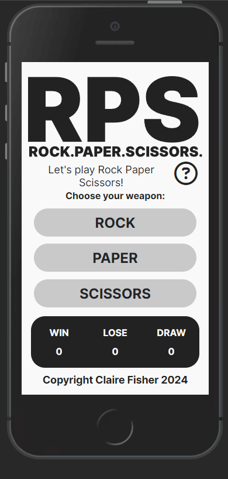

Screen Size: 2560px

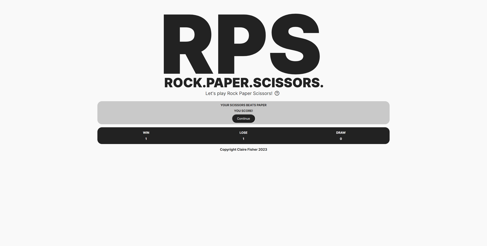

### Style and Script link functionality
To manaually test my CSS and JS links were functioning as intended: 
* I created a test h1 on my html.
* I added code in the style.css to make the h1 content red.
* I added code in the script.js to message the console. 
* Ran my project in a live browser.
* **Result:** Links working correctly.

Links Test Image

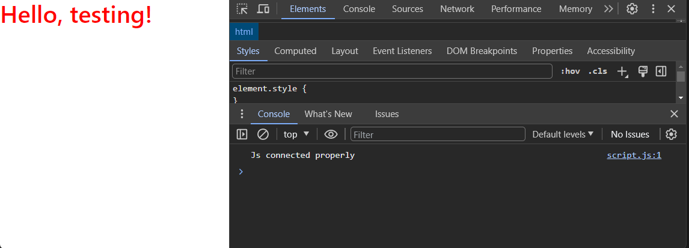

### Colour Scheme Contrast
Testing the contrast is high enough for readability:
  * H1 result: contrast rating = 9.6. Good readability.
  * H2 result: contrast rating = 15.11. Good readabilit
  * H3 result: contrast rating = 1.57 Low readability.
  * **Result:** Only the H1 and H2 combo examples will be used.

Colour Contrast Test Image

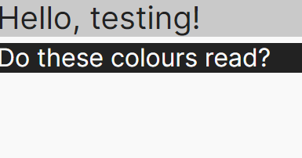

 

### Function Testing

Function Testing Image

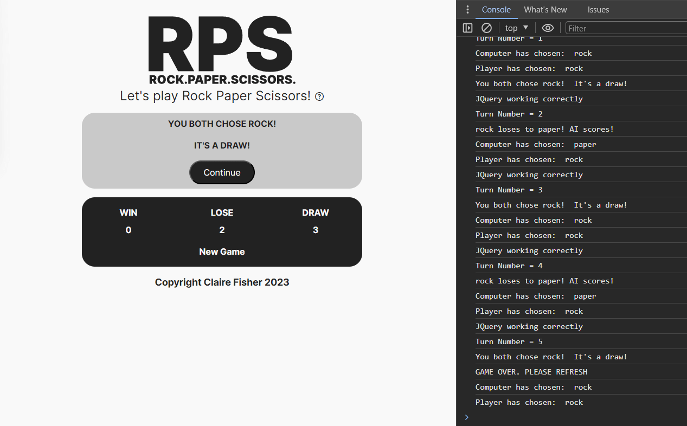

 
The functions are all tested via their output displayed in the UI, the console, or both. (All console.log and console.info have been removed in the final version of the project).

[**Back to top**](#testing-rock-paper-scissors)
## ***Bugs and Fixes:***

Below is a list of bugs I found during the development process by testing myself via the live server extension on VSCode. I tried each element for how the browser would display the page to potential users on a range of different screen widths from 320px to 4000px:-

1. **Game-countdown area visibility** - 
    * ***Issue Found:*** 
        * Game countdown area showing on page load. Needs to be hidden on load, and show briefly during countdown phase, before returning back to hidden.
    * ***Solution Used:*** 
        * Gave the countdown-area section the class of 'hidden'.
        * Styled with CSS to display: none. 
        * Added jquery function to remove 'hidden' class when the user clicks on a game-btn.
2. **Variable playersChoice not updating** 
    * ***Issue Found:***
        * Variable playersChoice assigning on page load & not updating with event listener
        * Error message in console stated playersChoice as an empty string still, even after button clicked.
        * Template literal blank where variable value should be. 
    * ***Solution Used:***    
        * Declared the variable with an empty string.
        * Created an updateChoices function & called it inside the handleButtonClick function.
3. **H1 styling issue** 
    * ***Issue Found:*** 
        * H1 line height was far too big and causing styling issues. Dropping lower elements further down the page. All attempts to restyle H1 failed to fix the issue. 
    * ***Solution Used:***    
        * Realised I had targeted the weapon buttons with the class .btn
        * .btn is a bootstrap class, so the styling I'd applied to the weapons buttons, was also targetting the bootstrap modal button in the H1. 
        * Targetted the weapons buttons with .game-btn instead (my own class name). Additional height properties no longer affecting the H1 element. 
4. **AI random weapon not updating correctly** 
    * ***Issue Found:*** 
        * The AI's randomly generated weapon was not updating after the first round.  
    * ***Solution Used:***    
        * Created an empty string variable. 
        * Reassigned this variable with the getRandomWeapon function inside the button click event. 
        * AI random weapon choice now refreshes on every click event. 
5. **New Game functionality** 
    * ***Issue Found:*** 
        * Continue button still operating as a "New Game" button after first game over. So game kept resetting every time user clicked Continue.
    * ***Solution Used:***    
        * Created a separate New Game button in the html. Previously the button's innerText switched between "Continue" and "New Game" with JavaScript.
        * Used show and hide JQuerys to switch between the two buttons at the correct time.
        * With separate buttons, I could then accurately target each one to excute the correct functions and JQuery commands.  
6. **rollCountdown function** 
    * ***Issue Found:*** 
        * Appeared rollCountdown function was not executing after it's first cycle.
        * Suspected issue was the countdown numbers were still classed as "hidden" after the first fadeOuts. Showing and hiding in different positions, and even later functions, did not fix the issue. 
    * ***Solution Used:***    
        * Not only did the numbers need to be unhidden with show(), but the opacity had to be reset back up to 1 so they werent transparent. Countdown now executes as expected. 

[**Back to top**](#testing-rock-paper-scissors)  
## **Post Development Testing**

Post development, I manually tested in the following ways:-

1. Manually tested each element for appearance and responsiveness via a simulated live server using an extension in VSCode.

2. The code passed through HTML, CSS, JavaScript(ES6) validators to check for errors.
* [**Validators Results**](#validators)
3. The code passed though an Accessibility evaluation. 
*  [**Accessibility Results**](#accessibility)
4. Published the page via GitHub pages and shared with fellow students to test and receive feedback.

5. Sent my gitHub to link to three third party testers with different devices, browsers, and skill sets:
    - Dan Sanderson - Senior Developer
    - Shaun Russell - Senior UI/UX/Product Designer
    - Tom Harris - Enterprise Account Manager, krystal.io and iOS user 

## **Post Development Testing Expanded**

My manual testing logs are as follows:
***
### Home Page Manual Testing
***
**Home Page Test 1 -  Incorrect URL (random letter character)**
* Expected:
  * Site expected to display 404 page when the user enters an incorrect URL.
* Testing:
  * Tested site by adding a random letter at the end of URL
* Result:
  * The site acted as expected and showed it’s custom 404 page.
* Action: 
  * None
***
**Home Page Test 2 -  Incorrect URL (random number character)**
* Expected:
  * Site expected to display 404 page when the user enters an incorrect URL.
* Testing:
  * Tested site by adding a random number at the end of URL
* Result:
  * The site acted as expected and showed it’s custom 404 page.
* Action: 
  * None
***
**Home Page Test 3 -  Incorrect URL (random special character)**
* Expected:
  * Site expected to display 404 page when the user enters an incorrect URL.
* Testing:
  * Tested site by adding a random special character at the end of URL
* Result:
  * The site acted as expected and showed it’s custom 404 page.
  * EXCEPTION: When the % character was added to the end of the URL, the site showed “400-Bad Request” page from Github. The user can return to the site by clicking “back” on the browser window. 
* Action: 
  * None
***
**Home Page Test 4 -  Clicking non-interactive elements**
* Expected:
  * Site expected to do nothing when the user clicks anywhere that’s not interactable. 
* Testing:
  * Tested site by clicking all over the site background. The logo. The score box area. The footer. H1, and paragraphs
* Result:
  * The site acted as expected and did nothing
* Action: 
  * None
***
### Modal Manual Testing
***
**Modal Test 1 -  Clicking the Modal Button**
* Expected:
  * Site expected to open the modal window when the user clicks the modal button. 
* Testing:
  * Tested site by clicking, and double-clicking, the modal button.
* Result:
  * The site acted as expected and displayed the modal window.
* Action: 
  * None
***
**Modal Test 2 -  Clicking around the Modal window**
* Expected:
  * Site expected to do nothing when the user clicks anywhere on modal (except the interactive elements). 
* Testing:
  * Tested site by clicking all over modal window, whilst avoiding the close buttons.
* Result:
  * The site acted as expected and did nothing.
* Action: 
  * None
***
**Modal Test 3 -  Clicking the close elements on the Modal**
* Expected:
  * Site expected to close the modal window when the user clicks the cross (top right) or the close (bottom right).
* Testing:
  * Tested site by clicking the cross, reopening the modal, then clicking close. 
* Result:
  * The site acted as expected and closed the modal window when the user clicks either the cross, or close
  * N.B Modal also closes when clicking outside the modal window. This is acceptable.
  * (Accessibility: both buttons can be targeted with the Tab keyboard button, and then hitting Enter).
* Action: 
  * None
***
### Weapon Buttons Manual Testing
***
**Weapon Buttons Test 1 -  ROCK Button**
* Expected:
  * When the Rock button is clicked, the site is expected to:-
    1. Hide weapon buttons
    2. Show countdown until end
    3. Hide countdown
    4. Show turn result box
    5. Show "Continue" or "New Game" button (Dependin on scores)
    6. Display message “YOUR PAPER…” (then either win/lose/draw etc, & who scores)
    7. (Tick or Cross or Eyes gifs should also display depending on turn outcome).
    8. Score area numbers update correctly depending on turn outcome.     
* Testing:
  * Tested site by clicking the Rock button.
* Result:
  * The site acted as expected and all the listed actions above displayed in order and with the correct strings.
  * (Accessibility: Rock button can also be targeted with Tab and pressing Enter).
* Action: 
  * None
***
**Weapon Buttons Test 2 -  PAPER Button**
* Expected:
  * When the Paper button is clicked, the site is expected to:-
    1. Hide weapon buttons
    2. Show countdown until end
    3. Hide countdown
    4. Show turn result box
    5. Show "Continue" or "New Game" button (Dependin on scores)
    6. Display message “YOUR PAPER…” (then either win/lose/draw etc, & who scores)
    7. (Tick or Cross or Eyes gifs should also display depending on turn outcome).
    8. Score area numbers update correctly depending on turn outcome.     
* Testing:
  * Tested site by clicking the Paper button.
* Result:
  * The site acted as expected and all the listed actions above displayed in order and with the correct strings.
  * (Accessibility: Paper button can also be targeted with Tab and pressing Enter).
* Action: 
  * None
***
**Weapon Buttons Test 3 -  SCISSORS Button**
* Expected:
  * When the Scissors button is clicked, the site is expected to:-
    1. Hide weapon buttons
    2. Show countdown until end
    3. Hide countdown
    4. Show turn result box
    5. Show "Continue" or "New Game" button (Dependin on scores)
    6. Display message “YOUR PAPER…” (then either win/lose/draw etc, & who scores)
    7. (Tick or Cross or Eyes gifs should also display depending on turn outcome).
    8. Score area numbers update correctly depending on turn outcome.    
* Testing:
  * Tested site by clicking the Scissors button.
* Result:
  * The site acted as expected and all the listed actions above displayed in order and with the correct strings.
  * (Accessibility: Scissors button can also be targeted with Tab and pressing Enter).
* Action: 
  * None
***
**Weapon Buttons Test 4 - Weapon Click Event Sequence**
* Expected:
  * Site expected to continue with weapon-click-event sequence when user tries to interrupt by clicking all over the site.    
* Testing:
  * Tested site by clicking a weapon button, and clicking all over the screen. 
* Result:
  * The site acted as expected and the sequence continued without interruption.
  * Except: Site still opened the Modal with the modal Button during the game sequence… but the sequence continued behind and displayed correctly when the modal was closed. 
  * Except: The site always refreshes, and clears all data, when the browser reload button is clicked. 
* Action:
  * None. All behaviours acceptable. 
***
### Continue Button Manual Testing
***
**Continue Button Test 1 -  Continue Click Event Sequence**
* Expected:
  * When the user clicks the “Continue” button, the site is expected to:
    1. Hide turn result area
    2. Hide the “Ai chooses…” area
    3. Show home screen / weapon select area
    4. Display “Take your next turn!” string above “Choose your weapon:”
    5. Wait for the user to select next click-event weapon
    6. Keep current scores accurate and displayed
* Testing:
  * Tested site by clicking the “continue” button. 
* Result:
  * The site acted as expected and did all of the action-list above.
  * (Accessibility: Continue button can also be targeted with Tab and pressing Enter).
* Action:
  * None.
***
### Game Over Status Manual Testing
***
**Win Result Test 1 -  Game Over Player Win Sequence**
* Expected:
  * If the “WIN” score is the first score value to equal 3, the site is expected to:
    1. Score area numbers update correctly depending on turn outcome.
    2. Display 1 of the 5 win-gifs randomly
    3. Display “CONGRATULATIONS! YOU WIN! In the turn result box
    4. Switch “Continue” button to “New Game” button
* Testing:
  * Tested the site by playing the game until multiple win results were achieved. 
* Result:
  * The site acted as expected and all the listed actions above displayed in order and with the correct strings. I continued until I won 5 times to check the win gifs are pulled randomly. The results were: Win 1 = chicken, Win 2 = child-cheering, Win 3 = chicken, Win 4 = shawn-sheep, Win 5 = shawn-sheep. Randomising as expected. 
* Action:
  * None.
***
**Lose Result Test 2 -  Game Over Player Lose Sequence**
* Expected:
  * If the “LOSE” score is the first score value to equal 3, the site is expected to:
    1. Score area numbers update correctly depending on turn outcome.
    2. Display the singular game-over gif.
    3. Display “GAME OVER: YOU LOSE! In the turn result box
    4. Change turn-result area to dark-bg and light-text
    5. Switch “Continue” button to “New Game” button
* Testing:
  * Tested the site by playing the game until multiple Lose results were achieved. 
* Result:
  * The site acted as expected and all the listed actions above displayed in order and with the correct strings. I continued until I lost 3 times.
* Action:
  * None.
***
**Draw Result Test 3 -  Draw Sequence**
* Expected:
  * If the “DRAW” score is the first score value to equal 3, the site is expected to:
    1. Score area numbers update correctly depending on turn outcome.
    2. Continue the game as a normal turn. 
    3. Allow the Draw score to increase beyond 3 until a game-over situation occurs. 
* Testing:
  * Tested the site by playing the game until the draw score reached 3, and higher.
* Result:
  * The site acted as expected and all the listed actions above displayed in order and with the correct strings. I continued until I managed to achieve a Draw score = 7. 
* Action:
  * None.
***
### New Game Button Manual Testing
***
* Expected:
  * When the user clicks the “New Game” button, the site is expected to:
    1. Hide the game-over gif (regardless of win or lose outcome).
    2. Hide the turn result area
    3. Hide the “Ai chooses…” area
    4. Show home screen / weapon select area
    5. Hide the “Take your next turn!” paragraph
    6. Reset all the scores back to zero in the display box
* Testing:
  * Tested the site by clicking the “New Game” button.
* Result:
  * The site acted as expected and did all of the action-list above.
  * (Accessibility: “New Game” button can also be targeted with Tab and pressing Enter).
* Action:
  * None.
***
[**Back to top**](#testing-rock-paper-scissors)

## **User Story Testing**
1. **As a user, I want to be entertained.**
  * The site provides:
    * Entertainment in the form of a game play. 
    * User interactive elements.
    * Fast feedback to user interactions. 
    * Countdown to build suspense.
    * Rewarding Game-Over feedback with animated gifs.
    * Availability on mobile device to play anywhere, and anytime.  
2. **As a user, I want to have a positive user experience.**
  * The site provides all points from Story 1, plus:
    * Fast load times.
    * Intuitive UI design.
    * Excellent flow.
    * Super easy user input (buttons).
    * Fast & responsive game functionality
    * Automated game data handing & results feedback.
3. **As a user, I want the game to be intuitive and the rules easy to find.**
  * The site provides:
    * Interactive elements are obvious and accessible.
    * The rules are available at all times on all screens.
    * Excellent flow. The interactive elements guide the user through the game sequence. 
4. **As a user, I want to use the project across multiple devices.**
 * The site provides:
    * Fully responsive UI design from screen sizes 320px to 2560px wide.
    * Compatibility across all major browsers.
5. **As a travelling user, I want to be able to play the game with my mobile device in one hand, while I hold onto a transport safety rail, or bags of groceries.**
 * The site provides:
    * Large, accessible, interative buttons which are easy to hit with your thumb while holding a device in one hand.
    * Easy user input. Every interactive element is a button, so the user is not required to enter text.
6. **As a differently abled user, I want the product to be accessible.**
 * The site provides:
   * Please see Features/High Standards of Accessibiliy section of the [README.md](/README.md)

[**Back to top**](#testing-rock-paper-scissors)
## **Validators**

### HTML - https://validator.w3.org/nu/

HTML validator Results Image

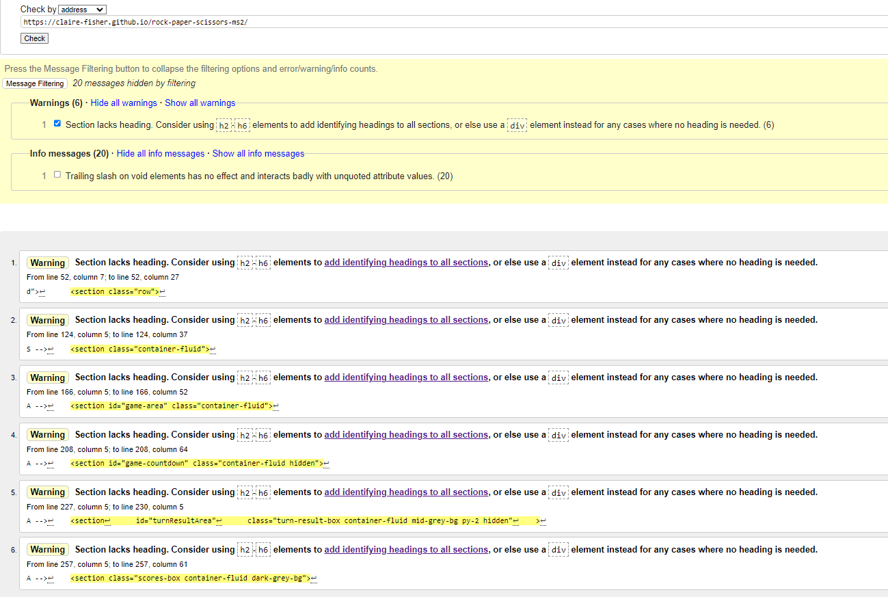

 

* ***Errors Found:***
    * None
* ***Warnings Found:***
    * 6x Section Lacks Heading
* ***Action Taken:***
    * None
    * Reason: They are Warnings and not errors. Forcing additional headings into the project would offer a minor improvement to asscessibility scores. As the accessibility Evaluation and Lighthouse Tests show the site has a good accessibility rating, changes will not be made at this time. 

### CSS - https://jigsaw.w3.org/css-validator/

CSS validator Results Image

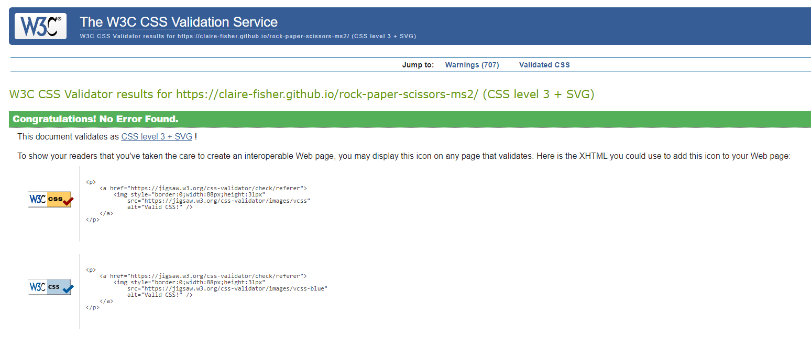

 

* ***Errors Found:***
    * None
* ***Action Taken:***
    * N/A

### JavaScript - https://jshint.com/

JS validator Results Image

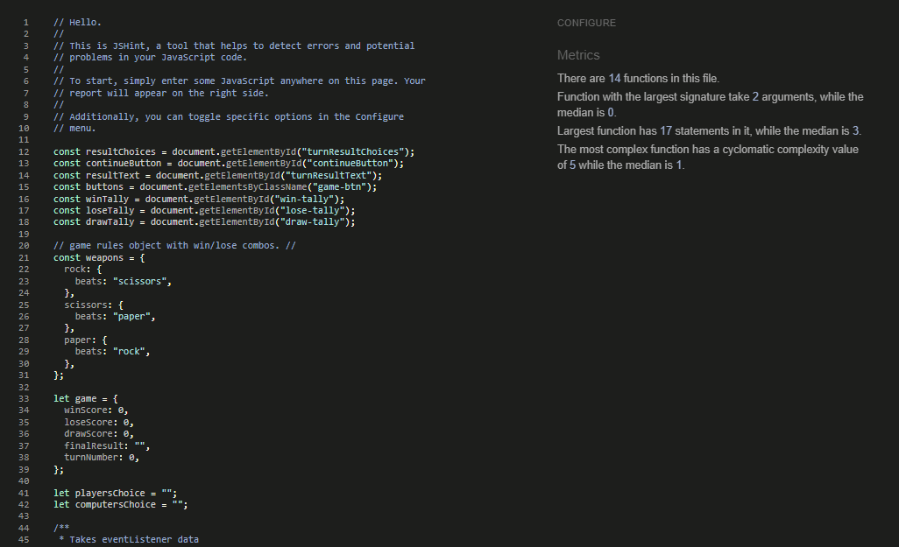

 

JSHint validator was configured to recognise New JavaScript Features (ES6), and jQuery.
* ***Errors Found:***
    * None
* ***Action Taken:***
    * N/A

## Lighthouse Scores
### Test conditions
* All lighthouse tests were run in incognito mode to avoid interference from browser extensions. 
* Both mobile and desktop performance are tested. 

Desktop Results

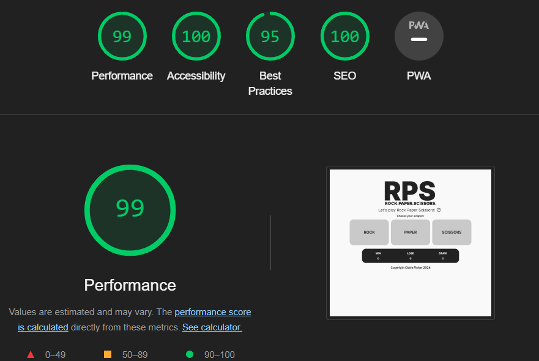

 

Mobile Results

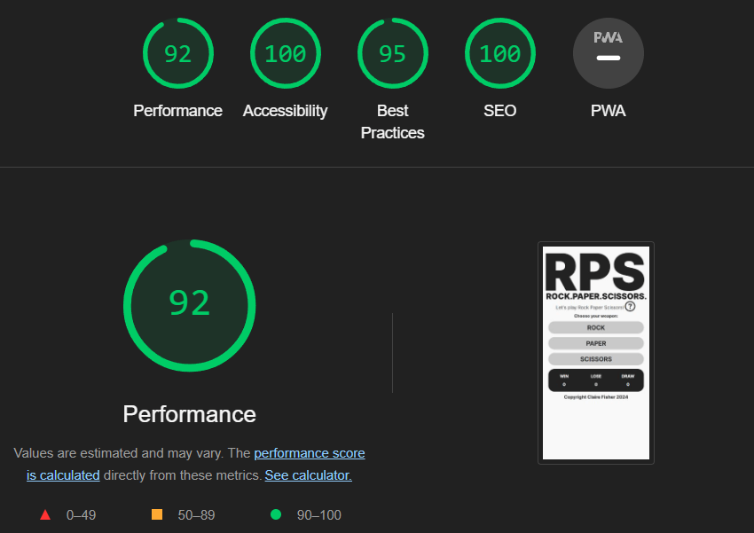

 
 
NOTE: After feedback from my site testers, 3 additional gifs were included in the project. (Tick / Cross / Eyes). This was to improve user feedback on what the Ai's weapon selection was at the end of each turn. This has reduced the sites performance on lighthouse scores in Chrome Dev Tools on Mobile devices only (Now approx rating of 73). No significant change on Desktop performance. None of my testers went on to report any noticeable performance change, so I wont be improving on this score at this time.

## **Accessibility** 
https://wave.webaim.org/

In addition to the accessibility score on lighthouse, [WAVE - Web accessibility evaluation tool](https://wave.webaim.org/) has been used to check the site for accessibility issues. 

Wave Accessibility Evaluation Results Image

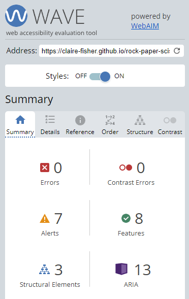

 

* ***Errors Found:***
    * None
* ***Contrast Errors Found:***
    * None
* ***Alerts Found:***
    * 6x Section Lacks Heading
* ***Action Taken:***
    * None.
    * Reason: They are Alerts and not errors. Forcing additional headings into the project would offer a minor improvement to asscessibility scores. As the Accessibility Evaluation and Lighthouse Tests show the site has a good accessibility rating, changes will not be made at this time. 

[**Back to top**](#testing-rock-paper-scissors) 
### **Third Party Testing**

1. **Final result "Draw"**
    * ***Tester feedback: Shaun Russell***
        * The "Final Result: Draw" outcome is confusing to the user. 
        * Suggestion: Have "Win" and "Lose" game completion options only.
        * Draw will continously tally until Win or Lose scores reach three.
2. **Final result "Lose"**
    * ***Tester feedback: Shaun Russell***
        * The "Final Result: Lose" outcome isn't obvious enough to the user. 
        * Suggestion: Have a single "Lose" game gif.
        * Lose outcome is still less favourable than win, as the single gif will be displayed every time a loss result is reached.

### Third Party Feedback
1. <u>**Dan Sanderson - Senior Developer.**</u>
  * "It looks great to me. Plays well and reliably. Nice job!".
 
  * "Some UI feedback, but it's minor, it's a bit difficult to know who's won each turn until you look closely and read the text. It's not in-your-face, but maybe that's what you're going for... One way around this might be to change the background colour of the results box to red or green if you lose or win, but I know your palette is monotone, so not sure how that would work".

  * "A future feature you could add would be to take all the hardcoded text out of your JS and HTML files and stick that in a language file. Then you can just run it through google translate or something and then have English and maybe French option etc which you can swap with a button."

2. <u>**Shaun Russell - Senior UX/UI/Product Designer.**</u>
  * "No issues to report really beyond the gifs not initially displaying which has now been resolved."
  * "I like that everything can be done one handed - so if folk are commuting and standing on a crowded public transport, they can play this to pass the time a little bit."
  * "Instructions are clear and readily accessible. UI is clean and clear and accessible. The GIFs are a nice reward / commiseration and denote the end of the game. The tick and cross to denote round win / loss is a good identifier. Maybe use your icons in instructions to denote what user and AI has picked"

3. <u>**Tom Harris: Safari Tester and screen width up to 2560px.**</u>
  * "Overall the game runs very well, no issues at all. The design is perfect - everything is very intuitive with no reason for me as a user to have to look far for the obvious next button to press". 

  * "The monochrome design really works in the games favour, text is clear and very easy to read, the rules page is clear and very nice way to show the rules".

  * "All the animations are purposeful and never made me wish things were faster, they add value to the game."

Tom Harris Feedback Notes

 

## Thank you to my product testers
- Richard Wells: Senior Developer, and my Code Institute Mentor.

- Dan Sanderson: Senior Developer.

- Shaun Russell: Senior UI/UX/Product Designer. 

- Tom Harris: Site tester, and my biggest cheerleader.

[**Back to top**](#testing-rock-paper-scissors)

[return to README.md](README.md)