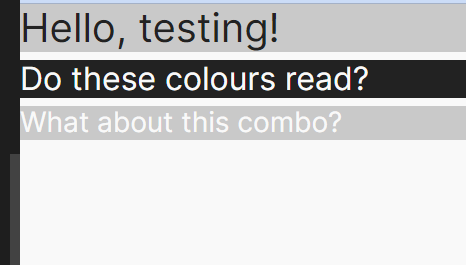

# Testing Rock Paper Scissors
This project was tested continuously during development. Post build, the site has been manually tested by myself and third party testers. It has also passed on html, CSS, JS, and accessibility validators. 

[return to README.md](README.md)
## Table of Contents
* [**During Development Testing**](#during-development-testing)
    * [*Manual Testing*](#manual-testing)
    * [*Bugs and Fixes*](#bugs-and-fixes)
* [**Post Development Testing**](#post-development-testing)
  * [**Validators**](#validators)
      * [*HTML*](#html---httpsvalidatorw3orgnu)
      * [*CSS*](#css---httpsjigsaww3orgcss-validator)
      * [*JavaScript*](#javascript---httpsjshint.com)
  * [**Lighthouse Scores**](#lighthouse-scores)
  * [**Accessability**](#accessability)
* [**Third Party Testing**](#third-party-testing-and-feedback)
*  [**Third Party Feedback**](#third-party-feedback)
* [**With Thanks**](#thank-you-to-my-product-testers)

## **During Development Testing**
During the development process, I was manually testing in the following ways:-

1. Manually tested each element for appearance and responsiveness via a simulated live server using an extension in VSCode.

2. Logged information to the console in Chrome Dev Tools to check JS function outputs. 
    
3. Published the page via GitHub pages and shared with fellow students to test and receive feedback.

## Manual Testing:

### Browser Compatibility
During testing, I used four different browsers to ensure cross-compatibility. The desktop browsers used by myself were:

  1. Chrome
  2. Firefox  
  3. Opera
  4. Edge

Tom Harris - Site tester - Tested the project on iOS / Safari.

### Screen Sizes

The site has been tested at screen sizes 320px to 2560px in width.

Screen Size: 320px

Screen Size: 2560px

### Style and Script link functionality
To manaually test my CSS and JS links were functioning as intended: 
* I created a test h1 on my html.
* I added code in the style.css to make the h1 content red.
* I added code in the script.js to message the console. 
* Ran my project in a live browser.
* **Result:** Links working correctly.

Links Test Image

### Colour Scheme Contrast
Testing the contrast is high enough for readability:
  * H1 result: contrast rating = 9.6. Good readability.
  * H2 result: contrast rating = 15.11. Good readabilit
  * H3 result: contrast rating = 1.57 Low readability.
  * **Result:** Only the H1 and H2 combo examples will be used.

Colour Contrast Test Image

 

### Function Testing

Function Testing Image

 
The functions are all tested via their output displayed in the UI, the console, or both. (All console.log and console.info have been removed in the final version of the project).

[**Back to top**](#testing-rock-paper-scissors)
## ***Bugs and Fixes:***

Below is a list of bugs I found during the development process by testing myself via the live server extension on VSCode. I tried each element for how the browser would display the page to potential users on a range of different screen widths from 320px to 4000px:-

1. **Game-countdown area visibility** - 
    * ***Issue Found:*** 
        * Game countdown area showing on page load. Needs to be hidden on load, and show briefly during countdown phase, before returning back to hidden.
    * ***Solution Used:*** 
        * Gave the countdown-area section the class of 'hidden'.
        * Styled with CSS to display: none. 
        * Added jquery function to remove 'hidden' class when the user clicks on a game-btn.
2. **Variable playersChoice not updating** 
    * ***Issue Found:***
        * Variable playersChoice assigning on page load & not updating with event listener
        * Error message in console stated playersChoice as an empty string still, even after button clicked.
        * Template literal blank where variable value should be. 
    * ***Solution Used:***    
        * Declared the variable with an empty string.
        * Created an updateChoices function & called it inside the handleButtonClick function.
3. **H1 styling issue** 
    * ***Issue Found:*** 
        * H1 line height was far too big and causing styling issues. Dropping lower elements further down the page. All attempts to restyle H1 failed to fix the issue. 
    * ***Solution Used:***    
        * Realised I had targeted the weapon buttons with the class .btn
        * .btn is a bootstrap class, so the styling I'd applied to the weapons buttons, was also targetting the bootstrap modal button in the H1. 
        * Targetted the weapons buttons with .game-btn instead (my own class name). Additional height properties no longer affecting the H1 element. 
4. **AI random weapon not updating correctly** 
    * ***Issue Found:*** 
        * The AI's randomly generated weapon was not updating after the first round.  
    * ***Solution Used:***    
        * Created an empty string variable. 
        * Reassigned this variable with the getRandomWeapon function inside the button click event. 
        * AI random weapon choice now refreshes on every click event. 
5. **New Game functionality** 
    * ***Issue Found:*** 
        * Continue button still operating as a "New Game" button after first game over. So game kept resetting every time user clicked Continue.
    * ***Solution Used:***    
        * Created a separate New Game button in the html. Previously the button's innerText switched between "Continue" and "New Game" with JavaScript.
        * Used show and hide JQuerys to switch between the two buttons at the correct time.
        * With separate buttons, I could then accurately target each one to excute the correct functions and JQuery commands.  
6. **rollCountdown function** 
    * ***Issue Found:*** 
        * Appeared rollCountdown function was not executing after it's first cycle.
        * Suspected issue was the countdown numbers were still classed as "hidden" after the first fadeOuts. Showing and hiding in different positions, and even later functions, did not fix the issue. 
    * ***Solution Used:***    
        * Not only did the numbers need to be unhidden with show(), but the opacity had to be reset back up to 1 so they werent transparent. Countdown now executes as expected. 
7. **Intended Outcome** 
    * ***Issue Found:*** 
        * 
    * ***Solution Used:***    
        *  

[**Back to top**](#testing-rock-paper-scissors)  
## **Post Development Testing**

Post development, I manually tested in the following ways:-

1. Manually tested each element for appearance and responsiveness via a simulated live server using an extension in VSCode.

2. The code passed through HTML & CSS validators to check for errors.

3. The code passed though an Accessibility evaluation. 
    
4. Published the page via GitHub pages and shared with fellow students to test and receive feedback.

5. Sent my gitHub to link to three third party testers with different devices, browsers, and skill sets:
    - Dan Sanderson - Senior Developer
    - Shaun Russell - Senior UI/UX/Product Designer
    - Tom Harris - Enterprise Account Manager, krystal.io and iOS user 

## User Story Testing
1. **As a user, I want to be entertained.**
  * The site provides:
    * Entertainment in the form of a game play. 
    * User interactive elements.
    * Fast feedback to user interactions. 
    * Countdown to build suspense.
    * Rewarding Game-Over feedback with animated gifs.
    * Availability on mobile device to play anywhere, and anytime.  
2. **As a user, I want to have a positive user experience.**
  * The site provides all points from Story 1, plus:
    * Fast load times.
    * Intuitive UI design.
    * Excellent flow.
    * Super easy user input (buttons).
    * Fast & responsive game functionality
    * Automated game data handing & results feedback.
3. **As a user, I want the game to be intuitive and the rules easy to find.**
  * The site provides:
    * Interactive elements are obvious and accessible.
    * The rules are available at all times on all screens.
    * Excellent flow. The interactive elements guide the user through the game sequence. 
4. **As a user, I want to use the project across multiple devices.**
 * The site provides:
    * Fully responsive UI design from screen sizes 320px to 2560px wide.
    * Compatibility across all major browsers.
5. **As a travelling user, I want to be able to play the game with my mobile device in one hand, while I hold onto a transport safety rail, or bags of groceries.**
 * The site provides:
    * Large, accessible, interative buttons which are easy to hit with your thumb while holding a device in one hand.
    * Easy user input. Every interactive element is a button, so the user is not required to enter text.
6. **As a differently abled user, I want the product to be accessible.**
 * The site provides:
   * Please see Features/High Standards of Accessibiliy section of the [README.md](/README.md)

[**Back to top**](#testing-rock-paper-scissors)
## **Validators**

### HTML - https://validator.w3.org/nu/

HTML validator Results Image

 

* ***Errors Found:***
    * None
* ***Warnings Found:***
    * 6x Section Lacks Heading
* ***Action Taken:***
    * None
    * Reason: They are Warnings and not errors. Forcing additional headings into the project would offer a minor improvement to asscessibility scores. As the Accessibility Evaluation and Lighthouse Tests show the site has a good accessibility rating, changes will not be made at this time. 

### CSS - https://jigsaw.w3.org/css-validator/

CSS validator Results Image

 

* ***Errors Found:***
    * None
* ***Action Taken:***
    * N/A

### JavaScript - https://jshint.com/

JS validator Results Image

 

JSHint validator was configured to recognise New JavaScript Features (ES6), and jQuery.
* ***Errors Found:***
    * None
* ***Action Taken:***
    * N/A

## Lighthouse Scores
### Test conditions
* All lighthouse tests were run in incognito mode to avoid interference from browser extensions. 
* Both mobile and desktop performance are tested. 

Desktop Results

 

Mobile Results

 

## Accessability - https://wave.webaim.org/
In addition to the accessability score on lighthouse, [WAVE - Web accessability evaluation tool](https://wave.webaim.org/) has been used to check the site for accessability issues. 

Wave Accessibility Evaluation Results Image

 

* ***Errors Found:***
    * None
* ***Contrast Errors Found:***
    * None
* ***Alerts Found:***
    * 6x Section Lacks Heading
* ***Action Taken:***
    * None.
    * Reason: They are Alerts and not errors. Forcing additional headings into the project would offer a minor improvement to asscessibility scores. As the Accessibility Evaluation and Lighthouse Tests show the site has a good accessibility rating, changes will not be made at this time. 

[**Back to top**](#testing-rock-paper-scissors) 
### **Third Party Testing**

1. **Final result "Draw"**
    * ***Tester feedback: Shaun Russell***
        * The "Final Result: Draw" outcome is confusing to the user. 
        * Suggestion: Have "Win" and "Lose" game completion options only.
        * Draw will continously tally until Win or Lose scores reach three.
2. **Final result "Lose"**
    * ***Tester feedback: Shaun Russell***
        * The "Final Result: Lose" outcome isn't obvious enough to the user. 
        * Suggestion: Have a single "Lose" game gif.
        * Lose outcome is still less favourable than win, as the single gif will be displayed every time a loss result is reached.

### Third Party Feedback

1. **Tom Harris: Safari Tester and screen width up to 2560px.** 
  * Project comment: "Overall the game runs very well, no issues at all. The design is perfect - everything is very intuitive with no reason for me as a user to have to look far for the obvious next button to press. 

  * The monochrome design really works in the games favour, text is clear and very easy to read, the rules page is clear and very nice way to show the rules.

  * All the animations are purposeful and never made me wish things were faster, they add value to the game."

Tom Harris Feedback Notes

 

## Thank you to my product testers
- Richard Wells: Senior Developer, and my Code Institute Mentor.

- Dan Sanderson: Senior Developer.

- Shaun Russell: Senior UI/UX/Product Designer. 

- Tom Harris: Site tester, and my biggest cheerleader.

[**Back to top**](#testing-rock-paper-scissors)

[return to README.md](README.md)